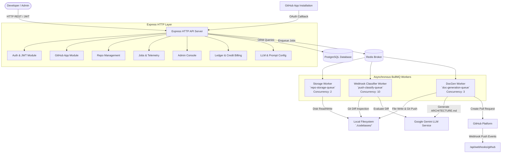
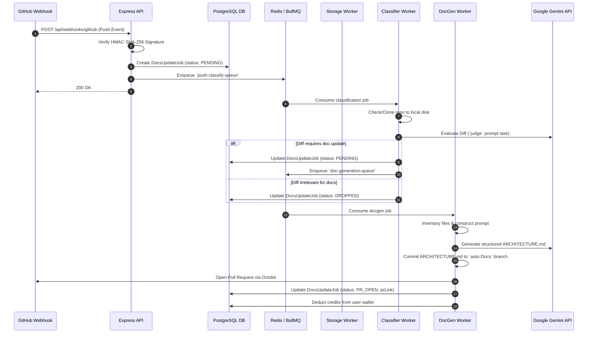

# AutoDocs Core Engine — System Architecture

## 1. Executive Summary & Architectural Approach

**AutoDocs Core Engine** is an autonomous, commit-driven AI documentation platform. The system automatically inspects codebases, evaluates git diffs against prompt rules, and generates or updates technical documentation (`ARCHITECTURE.md`) via automated GitHub Pull Requests.

### Core Architectural Style
- **Event-Driven Micro-Monolith**: Built on Node.js (TypeScript), Express.js, PostgreSQL (Prisma ORM), Redis, and BullMQ.
- **Asynchronous Execution Pipeline**: Heavy disk I/O (cloning, git operations) and LLM inferencing are decoupled from standard HTTP request/response lifecycles via BullMQ workers.
- **Multi-Tier LLM Orchestration & Scoped Caching**: Flexible model roster binding (`ModelRoster`, `LLMTaskConfig`, `Prompt`) with provider abstractions and Gemini context caching (`ScopedCacheService`).
- **GitHub App & Webhook Integration**: Authenticates using GitHub App installation tokens, processes push webhooks with HMAC SHA-256 verification, and automatically opens PRs on target repositories.

---

## 2. High-Level System Topology



---

## 3. Asynchronous Execution & Worker Queue Topology

The background processing architecture utilizes **BullMQ** over Redis connection pools to isolate compute and network workloads across three distinct queues:



### Queue Configuration Overview

| Queue Name | Responsibilities | Default Concurrency | Retry / Backoff Strategy |
| :--- | :--- | :--- | :--- |
| `repo-storage-queue` | Shallow repo clones, deep clones, local folder cleanups | `2` | 3 attempts, exponential backoff (5s) |
| `push-classify-queue` | Webhook push event diff evaluation & LLM filtering | `10` | 2 attempts, exponential backoff (3s) |
| `doc-generation-queue` | Full AST inventory assembly, LLM document generation, git commits, PR creation | `3` | 3 attempts, exponential backoff (10s) |

---

## 4. Data Models & Persistence Architecture

Persistence is implemented using **PostgreSQL** via **Prisma ORM** (`src/prisma/schema.prisma`). Local repository checkouts are persisted on disk under `codebases/<repoId>`.

### Primary Entity Relationship Summary

```mermaid
erDiagram
    User ||--o{ RefreshSession : 