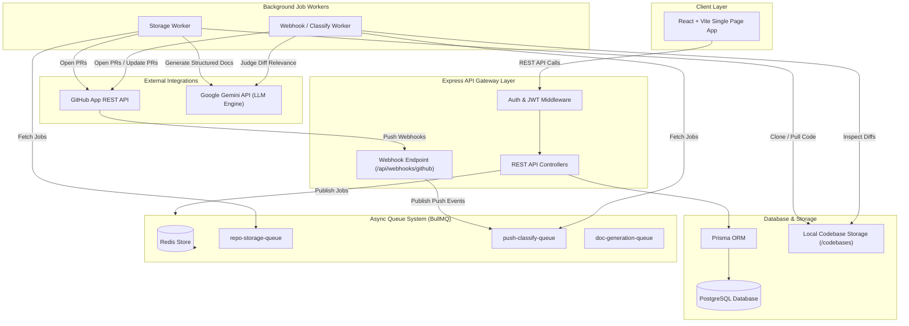
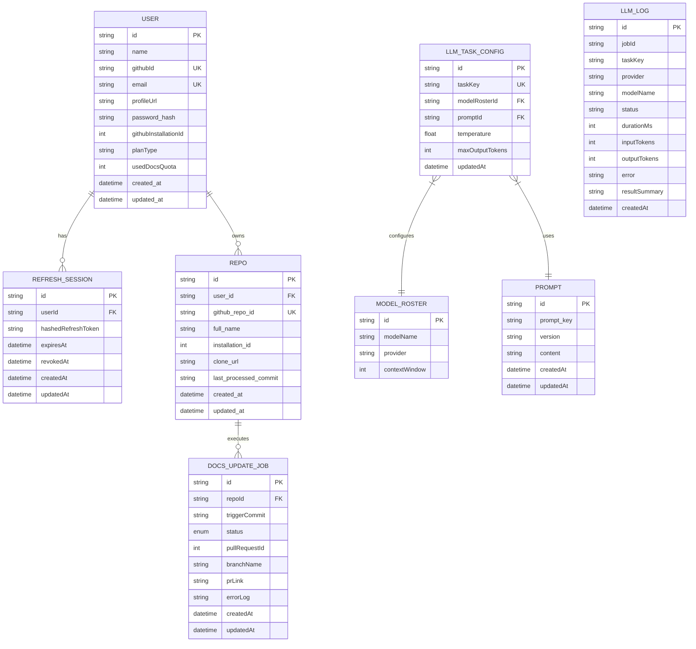
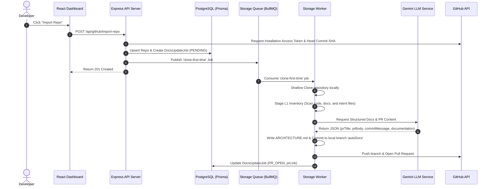

# System Architecture & Technical Documentation

## 1. System Overview
* **High-Level Purpose:** AutoDocs is an automated AI-powered documentation engine designed for GitHub repositories. It monitors codebases, evaluates diffs from push events via webhooks, generates up-to-date repository technical documentation (e.g., `ARCHITECTURE.md`), and automatically submits Pull Requests containing updated documentation to user repositories.
* **Core Design Pattern:** Distributed Asynchronous Queue Architecture & Layered Micro-services Pattern.
  - **Frontend:** React SPA built with Vite and context-driven state management.
  - **Backend Server:** Node.js Express REST API handling authentication, webhooks, admin management, and job orchestration.
  - **Queue & Worker Pipeline:** Redis-backed BullMQ processing asynchronous storage, classification, and heavy LLM documentation tasks.
  - **Database:** PostgreSQL managed via Prisma ORM for persistent refresh sessions, user settings, repository metadata, LLM prompt/model rosters, and telemetry logs.

---

## 2. Technology Stack & Dependencies

| Category | Technology / Library | Purpose in this Project |
| :--- | :--- | :--- |
| **Frontend Core** | React 18, TypeScript, Vite | User dashboard interface, auth management, repository selection, and job status tracking |
| **UI & Icons** | Lucide React, Custom CSS Glassmorphism | Responsive modern dark-mode user interface |
| **Backend Core** | Express.js, Node.js (v22), TypeScript | Core REST API backend, webhooks receiver, middleware enforcement |
| **Database & ORM** | PostgreSQL, Prisma ORM, `@prisma/adapter-pg` | Relational data persistence for users, sessions, jobs, and LLM configurations |
| **Message Broker** | Redis, BullMQ, `ioredis` | Asynchronous task queues (`repo-storage-queue`, `push-classify-queue`, `doc-generation-queue`) |
| **Authentication** | GitHub OAuth 2.0, JWT, bcrypt, cookie-parser | Access token issuance, httpOnly refresh session persistence, password hashing |
| **GitHub Integration**| Octokit (`@octokit/rest`, `@octokit/auth-app`), `simple-git` | GitHub App API interactions, repository cloning, branch management, and Pull Request creation |
| **LLM & AI Engine** | `@google/genai` (Google Gemini API), Tiktoken, Zod | Token context calculation, structured JSON prompt generation, git diff evaluation |

---

## 3. High-Level Architecture Diagram



---

## 4. Directory & Module Structure

```
/ (Repository Root)
├── client/                     # Frontend React application
│   ├── src/
│   │   ├── components/         # Dashboard UI components (RepoList, ImportedRepoList, etc.)
│   │   ├── context/            # Authentication Context & Provider
│   │   ├── services/           # Client API integration layer
│   │   ├── App.tsx             # Root React application wrapper
│   │   └── main.tsx            # DOM Mounting script
│   └── vite.config.ts          # Vite bundler & dev server proxy config
├── src/                        # Backend Node.js Express Application
│   ├── admin/                  # Admin controllers, routes, and master telemetry statistics
│   ├── auth/                   # Authentication controllers, JWT service, OAuth providers
│   ├── config/                 # Environment validation (env.ts) & Redis settings
│   ├── dashboard/              # User dashboard statistics services
│   ├── github/                 # GitHub App management, webhooks handler, simple-git drivers
│   ├── jobs/                   # Job status, retrieval, and retry controllers
│   ├── LLM/                    # Dynamic LLM provider factory, prompt registry, Gemini integrations
│   ├── pipeline/               # Multi-stage documentation generation orchestrator & stages
│   │   └── stages/             # Stage L1 (Inventory), Stage L2 (Judge), Stage L4 (TinyDocs)
│   ├── prisma/                 # Database Prisma Client instantiation & migration configuration
│   ├── queue/                  # BullMQ queues definitions and publisher methods
│   ├── repo/                   # Imported repository management and document file fetchers
│   ├── user/                   # User profile fetching and mutation services
│   ├── worker/                 # Storage worker & Webhook classifier background workers
│   └── index.ts                # Application entry point and Express server router initialization
├── Dockerfile                  # Container build instructions
├── docker-compose.yml          # Postgres, Redis, and App container setup
└── package.json                # Server runtime dependencies and scripts
```

---

## 5. Data Models & Database Schema



---

## 6. API Surface, Routes & Interfaces

### Authentication Routes (`/auth`)
| Method | Endpoint | Auth | Description |
| :--- | :--- | :--- | :--- |
| `GET` | `/auth/github` | None | Initiates GitHub OAuth authentication flow |
| `GET` | `/auth/github/callback` | None | Handles GitHub OAuth callback and sets HttpOnly refresh cookie |
| `GET` | `/auth/google` | None | Google OAuth flow stub |
| `GET` | `/auth/google/callback` | None | Google OAuth callback stub |
| `POST` | `/auth/refresh` | Cookie | Refreshes access JWT using valid httpOnly refresh session cookie |
| `POST` | `/auth/logout` | Cookie | Revokes current refresh session |
| `DELETE` | `/auth/user` | Bearer JWT | Permanently deletes user account |

### Webhooks (`/api/webhooks`)
| Method | Endpoint | Auth | Description |
| :--- | :--- | :--- | :--- |
| `POST` | `/api/webhooks/github` | HMAC SHA256 Signature | Processes GitHub `push` event payloads |

### GitHub App & Repositories (`/api/github`)
| Method | Endpoint | Auth | Description |
| :--- | :--- | :--- | :--- |
| `GET` | `/api/github/setup` | Query State | Post-installation callback handling from GitHub App setup |
| `GET` | `/api/github/installation-status` | Bearer JWT | Verifies if current user has installed the GitHub App |
| `GET` | `/api/github/accessible-repos` | Bearer JWT | Lists repositories accessible to the GitHub App installation |
| `GET` | `/api/github/imported-repos` | Bearer JWT | Lists repositories imported into AutoDocs by the user |
| `POST` | `/api/github/import-repo` | Bearer JWT | Imports repository, performs initial clone, and triggers doc generation |
| `DELETE` | `/api/github/repo/:repoId` | Bearer JWT | Deletes an imported repository and schedules workspace cleanup |

### Jobs & Documentation Management (`/api/jobs`, `/api/repos`)
| Method | Endpoint | Auth | Description |
| :--- | :--- | :--- | :--- |
| `GET` | `/api/jobs` | Bearer JWT | Retrieves paginated documentation update jobs |
| `GET` | `/api/jobs/:jobId` | Bearer JWT | Gets details for a specific documentation job |
| `POST` | `/api/jobs/:jobId/retry` | Bearer JWT | Re-queues a failed or pending job |
| `GET` | `/api/repos/:repoId` | Bearer JWT | Gets repository details and job execution history |
| `POST` | `/api/repos/:repoId/trigger` | Bearer JWT | Manually triggers documentation generation for a repository |
| `GET` | `/api/repos/:repoId/docs` | Bearer JWT | Fetches generated `ARCHITECTURE.md` content |

### LLM Configuration & Admin Services (`/api/admin`, `/api/llm-config`, `/api/prompts`, `/api/models`)
| Method | Endpoint | Auth | Description |
| :--- | :--- | :--- | :--- |
| `GET` | `/api/admin/users` | Bearer JWT | Lists system users with usage metrics |
| `GET` | `/api/admin/stats` | Bearer JWT | Master platform analytics and BullMQ queue health check |
| `GET` | `/api/llm-config` | Bearer JWT | Fetches configured task-to-model LLM mappings |
| `POST` | `/api/prompts` | Bearer JWT | Registers or updates dynamic prompt templates |
| `GET` | `/api/models` | Bearer JWT | Lists available LLM model roster |

---

## 7. Key Data Flows & Sequences

### First-Time Repository Import Flow


---

## 8. Configuration & Environment Variables

| Variable | Type | Required | Description |
| :--- | :--- | :--- | :--- |
| `PORT` | Number | No (Default `5000`) | Express API HTTP server listening port |
| `GITHUB_WEBHOOK_SECRET` | String | Yes | HMAC Secret used to verify GitHub webhook signatures |
| `GITHUB_CLIENT_ID` | String | Yes | GitHub OAuth App Client ID |
| `GITHUB_CLIENT_SECRET` | String | Yes | GitHub OAuth App Client Secret |
| `GITHUB_APP_ID` | String | Yes | GitHub App ID |
| `GITHUB_APP_PRIVATE_KEY` | String | Yes | GitHub App Private Key for installation token signing |
| `GITHUB_APP_SLUG` | String | Yes | GitHub App URL slug name (e.g. `aiautodocs`) |
| `DATABASE_URL` | String | Yes | PostgreSQL connection string URL |
| `JWT_ACCESS_SECRET` | String | Yes | Secret key used to sign access JWTs |
| `JWT_REFRESH_SECRET` | String | Yes | Secret key used to sign session refresh JWTs |
| `ACCESS_TOKEN_EXPIRY` | String | Yes | Access token expiration duration (e.g. `15m`) |
| `REFRESH_TOKEN_EXPIRY` | String | Yes | Refresh session token expiration duration (e.g. `7d`) |
| `SERVER_URL` | URL | Yes | Publicly accessible URL for Express API server |
| `CLIENT_URL` | URL | Yes | Frontend application base URL |
| `GEMINI_API_KEY` | String | Yes | API key for Google Gemini Generative AI Service |
| `REDIS_HOST` | String | No (Default `localhost`) | Hostname for Redis instance |
| `REDIS_PORT` | Number | No (Default `6379`) | Connection port for Redis instance |