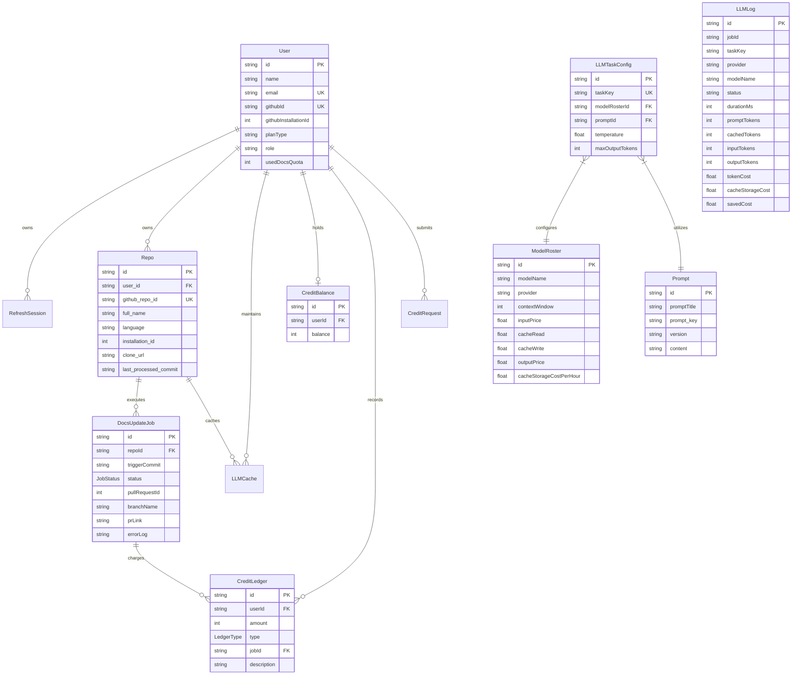
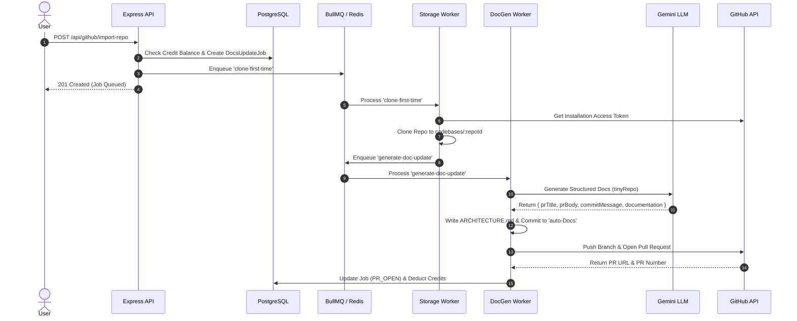

# System Architecture Documentation (ARCHITECTURE.md)

## 1. Architectural Patterns, Approach & Core Technology

### System Overview
AutoDocs is an autonomous, commit-driven AI documentation platform that automatically generates, updates, and reconciles system architecture documentation (`ARCHITECTURE.md`) in tracked GitHub repositories. The system monitors GitHub repository push events via webhooks, classifies codebase changes for architectural impact using an AI diff judge, generates updated architectural documentation using structured Gemini LLM models with prompt caching, and submits the changes directly back to the target repository via automated GitHub Pull Requests.

### Core Architectural Patterns
- **Event-Driven Asynchronous Processing**: Asynchronous tasks (repository cloning, diff evaluation, LLM documentation generation, and GitHub PR creation) are decoupled from HTTP request cycles using BullMQ job queues backed by Redis.
- **Tiered Diff Filtering & LLM Judging**: Webhook updates undergo a multi-tier evaluation pipeline. Local git diff filtering eliminates non-code/binary edits before delegating to a deterministic LLM classifier (`judge` task) to avoid unnecessary AI generation costs.
- **Provider & Model Abstraction Layer**: An extensible LLM provider factory (`LLMFactory`) and service layer abstract underlying AI providers (Google Gemini, with dynamic configurations for OpenAI and Anthropic).
- **Prompt Context Caching**: Utilizes Google GenAI's server-side context caching (`ScopedCacheService`) keyed by `(userId, repoId, taskKey, commitSha)` to avoid re-sending static codebase context on delta updates.
- **Stateless API & Token-Based Auth**: Stateless Express backend relying on HTTP Bearer JWTs for access tokens and server-stored hashed refresh session tokens (`RefreshSession`) in PostgreSQL.

### Key Technologies & Dependencies
- **Runtime**: Node.js (ES2022 / CommonJS output) running Express v5.
- **Database & Persistence**: PostgreSQL managed via Prisma ORM (`@prisma/client` with `@prisma/adapter-pg`).
- **Queue & Event Broker**: Redis & BullMQ (`repo-storage-queue`, `push-classify-queue`, `doc-generation-queue`).
- **AI Engine**: `@google/genai` (Google GenAI SDK) with structured JSON enforcement (`zod-to-json-schema` and `tiktoken` token estimations).
- **Git & GitHub Integration**: `simple-git` for local workspace manipulations; Octokit (`@octokit/rest`, `@octokit/auth-app`) for GitHub App authentication, repository cloning token generation, and Pull Request orchestration.
- **Security & Cryptography**: `bcrypt` for session hashing, `jsonwebtoken` for access/refresh tokens, and HMAC-SHA256 signature verification for GitHub webhooks.

---

## 2. High-Level System Architecture Topology

```mermaid
flowchart TD
    subgraph External Systems
        GitHub[GitHub Webhooks & REST API]
        UserBrowser[Client Web Application]
        GeminiAPI[Google Gemini LLM Service]
    end

    subgraph API & HTTP Service Layer
        ExpressServer[Express.js Server / Port 5000]
        AuthMiddleware[JWT / RBAC Middleware]
        WebhookHandler[Webhook Signature Verifier]
    end

    subgraph Persistence & Messaging
        Postgres[(PostgreSQL Database)]
        Redis[(Redis Cache / BullMQ Broker)]
    end

    subgraph Background Workers (BullMQ)
        StorageWorker[Storage Worker
repo-storage-queue]
        ClassifyWorker[Webhook Worker
push-classify-queue]
        DocGenWorker[DocGen Worker
doc-generation-queue]
    end

    subgraph Local Storage
        DiskStorage[Local Disk Repository Cache
codebases/repoId/]
    end

    %% Ingress Flows
    UserBrowser -->|HTTP REST Requests| ExpressServer
    GitHub -->|Push Webhooks| WebhookHandler
    WebhookHandler --> ExpressServer

    %% Middleware & Persistence
    ExpressServer --> AuthMiddleware
    ExpressServer --> Postgres
    ExpressServer -->|Enqueue Jobs| Redis

    %% Queue Workers
    Redis -->|Consume Storage Jobs| StorageWorker
    Redis -->|Consume Classify Jobs| ClassifyWorker
    Redis -->|Consume DocGen Jobs| DocGenWorker

    %% Worker Operations
    StorageWorker -->|Clone/Pull Git Repos| DiskStorage
    StorageWorker -->|Publish Import Task| Redis
    ClassifyWorker -->|Fetch Diff & Local Git| DiskStorage
    ClassifyWorker -->|Evaluate Diff with Judge| GeminiAPI
    ClassifyWorker -->|Enqueue Valid Updates| Redis
    DocGenWorker -->|Read Codebase Context| DiskStorage
    DocGenWorker -->|Generate Structured Docs| GeminiAPI
    DocGenWorker -->|Write ARCHITECTURE.md & Commit| DiskStorage
    DocGenWorker -->|Create Pull Request| GitHub
    DocGenWorker -->|Deduct Credits & Update Status| Postgres
```

---

## 3. Data Models, Schemas & Persistence

Data is persisted in PostgreSQL using Prisma. The primary entities and relationships are structured as follows:



### Key Database Entities
- **User**: System users authenticating via GitHub/Google. Tracks role (`USER`, `ADMIN`), GitHub App installation ID, and docs usage quota.
- **RefreshSession**: Secure refresh token sessions storing bcrypt-hashed refresh tokens, expiration timestamps, and revocation flags.
- **Repo**: Connected GitHub repositories storing GitHub installation details, clone URLs, and the latest processed commit SHA.
- **DocsUpdateJob**: State tracker for documentation generation pipelines. Tracks pipeline status (`PENDING`, `CLONING`, `SCANING`, `GENERATING`, `PR_OPEN`, `COMPLETED`, `FAILED`, `WAITING_LLM_JUDGE`, `LLM_JUDGE_REJECTED`, `DROPPED`, `MERGED`, `INSUFFICIENT_CREDITS`).
- **ModelRoster & LLMTaskConfig & Prompt**: Dynamic AI configuration registry allowing admins to adjust prompt templates, model bindings (e.g., Gemini 3.6 Flash vs Gemini 2.5 Pro), output token limits, and unit prices ($ USD per million tokens) per task stage (`tinyRepo`, `judge`, `docsGenerator`).
- **LLMLog**: Comprehensive telemetry table recording execution latency, input/cached/output token counts, provider token costs, and saved cache costs.
- **CreditBalance & CreditLedger & CreditRequest**: Virtual wallet system where 1 Credit = $0.01 USD (with a default 30% margin multiplier on provider API costs). Supports signup grants, usage deductions, manual grant requests, and direct admin top-ups.

---

## 4. API Surface & Interface Surface

All protected `/api/*` endpoints require a valid HTTP `Authorization: Bearer <JWT>` header unless explicitly marked public.

### Authentication & Security Routes (`/auth`)
- `GET /auth/github` — Initiates GitHub OAuth authorization flow.
- `GET /auth/github/callback` — Handles OAuth callback, sets HTTP-only refresh token cookie, redirects to client.
- `POST /auth/refresh` — Exchanges valid refresh cookie for a new JWT access token.
- `POST /auth/logout` — Revokes current refresh session.
- `DELETE /auth/user` — Deletes authenticated user account.

### Repository Management (`/api/github` & `/api/repos`)
- `GET /api/github/installation-status` — Returns user's GitHub App installation status.
- `GET /api/github/accessible-repos` — Lists non-imported repositories accessible via GitHub App.
- `GET /api/github/imported-repos` — Lists repositories imported into AutoDocs.
- `POST /api/github/import-repo` — Imports repository, creates initial sync job, enqueues shallow clone.
- `DELETE /api/github/repo/:repoId` — Deletes repository, cancels pending BullMQ jobs, removes disk cache.
- `GET /api/repos/:repoId` — Fetches detailed repository stats and historical jobs.
- `POST /api/repos/:repoId/trigger` — Manually triggers documentation generation job.
- `GET /api/repos/:repoId/docs` — Reads generated `ARCHITECTURE.md` directly from disk storage.

### Jobs & Execution Logs (`/api/jobs`)
- `GET /api/jobs` — Paginated list of execution jobs with status/repository filters.
- `GET /api/jobs/:jobId` — Job deep-dive including execution timeline, token breakdown, and stdout logs.
- `POST /api/jobs/:jobId/retry` — Re-queues failed/rejected/paused documentation job.
- `GET /api/jobs/stream` — Real-time Server-Sent Events (SSE) telemetry stream for active jobs.
- `GET /api/jobs/stats` — Quick telemetry ribbon metrics (credits burned today, delivered PRs, active hooks).

### Billing & Credits (`/api/billing`)
- `GET /api/billing/summary` — Billing overview including current credit balance and 7/28/90-day usage sparklines.
- `GET /api/billing/balance` — Returns active wallet credit balance.
- `GET /api/billing/ledger` — Paginated credit transaction history.
- `POST /api/billing/request` — Submits manual credit grant request.
- `POST /api/billing/admin/requests/:requestId/approve` / `reject` — Admin approval/rejection of credit requests.
- `POST /api/billing/admin/grant-direct` — Direct admin credit top-up to target user.

### AI System Configuration (`/api/llm-config`, `/api/prompts`, `/api/models`)
- `GET / POST / PUT / DELETE /api/llm-config` — Admin management of task-to-model task bindings.
- `GET / POST / PUT / DELETE /api/prompts` — Admin management of prompt templates.
- `GET / POST / PUT / DELETE /api/models` — Admin management of model pricing roster.

### Global Search & Telemetry (`/api/search`, `/api/usage`)
- `GET /api/search?q=:query` — Global search across repositories, execution jobs, and system users.
- `GET /api/usage/repo/:repoId` — Token usage and financial costs for a repository.
- `GET /api/usage/user/:userId` — Aggregated token usage and financial costs for a user.

### Webhooks (`/api/webhooks`)
- `POST /api/webhooks/github` — Public webhook receiver verifying HMAC SHA-256 signature (`X-Hub-Signature-256`). Processes GitHub `push` and `pull_request` merge/close events.

---

## 5. Directory Structure & Module Boundaries

```
src/
├── LLM/                     # AI Engine & Provider Abstraction Layer
│   ├── config/              # Task configs, prompt/model mappings, and service cache
│   ├── models/              # Model roster CRUD service and controller
│   ├── prompts/             # System prompt template management
│   ├── providers/           # BaseLLMProvider and GeminiProvider implementations
│   ├── llm.cache.service.ts # Google GenAI Scoped Server-Side Context Caching
│   ├── llm.factory.ts       # LLM provider factory registry
│   ├── llm.service.ts       # Primary structured generation & cost logging orchestrator
│   └── llm.types.ts         # Zod schemas for DocsAndPR and DiffJudge outputs
├── admin/                   # Superadmin platform management & global queue stats
├── auth/                    # OAuth providers (GitHub/Google), JWT issuance & session service
├── billing/                 # Virtual credit ledger, wallet management, and grant requests
├── config/                  # Validated Zod environment configuration & Redis connection
├── dashboard/               # Main dashboard overview metrics and activity sparklines
├── github/                  # GitHub App Octokit handlers, Webhook receiver, and Git actions
├── jobs/                    # Pipeline job telemetry, execution logs, and SSE streams
├── middleware/              # Express authentication, error handler, and RBAC middleware
├── pipeline/                # Documentation generation core logic
│   ├── stages/              # L1 Inventory scanner, L2 Judge diff evaluator, L4 TinyDocs packer
│   └── pipeline.orchestrator.ts # Pipeline orchestrator functions
├── prisma/                  # Prisma client initialization, schema definition, and migrations
├── queue/                   # BullMQ publishers and queue definitions
├── repo/                    # Repository management and generated doc disk reader
├── search/                  # Global unified search service
├── usage/                   # Token usage and cost analysis services
├── user/                    # User identity profile management
├── utils/                   # Helpers: async handlers, HMAC security, paths, loggers
└── worker/                  # BullMQ background queue workers
    ├── storage.worker.ts    # Concurrency 2: Repo cloning, fetching, and local cleanup
    ├── webhook.worker.ts    # Concurrency 1: Webhook push diff classification & credit validation
    └── docgen.worker.ts     # Concurrency 3: Heavy LLM generation, commit, push & PR creation
```

---

## 6. Asynchronous Processing & Queue Topology

AutoDocs uses three specialized BullMQ queues backed by Redis to manage background tasks cleanly without blocking the primary web application:

1. **`repo-storage-queue` (Storage Worker)**:
   - **Concurrency**: 2 (Protects disk I/O and network bandwidth).
   - **Jobs**: `clone-first-time` (shallow `--depth=1` clone), `clone-deep-push` (full clone when local cache is missing), `cleanup-repo` (deletes local folder and job records).
2. **`push-classify-queue` (Webhook Worker)**:
   - **Concurrency**: 1 (Processes incoming push webhooks sequentially).
   - **Jobs**: `push-classify-queue` (Verifies credit balance, downloads local changes, runs LLM Judge diff classification).
3. **`doc-generation-queue` (DocGen Worker)**:
   - **Concurrency**: 3 (Manages AI model output rate limits and token quotas).
   - **Jobs**: `generate-doc-update` (Packs repository inventory, invokes Gemini structured generation, writes `ARCHITECTURE.md`, commits changes, pushes `auto-Docs` branch, opens GitHub PR, and deducts user credits).

---

## 7. End-to-End Data Flows

### Workflow 1: Initial Repository Import & First-Time Doc Generation
1. **Trigger**: User imports repository via `POST /api/github/import-repo`.
2. **Credit Check**: System verifies user has at least 10 credits available.
3. **Job Creation**: Creates a `DocsUpdateJob` record in PostgreSQL with status `PENDING` (or `INSUFFICIENT_CREDITS` if balance is low).
4. **Queue Dispatch**: Enqueues `clone-first-time` job into `repo-storage-queue`.
5. **Storage Worker**: Clones repository using authenticated GitHub installation token to `codebases/:repoId`.
6. **Inventory Scan (L1)**: Filters code/intent/doc files, checks token compatibility against model context limits.
7. **DocGen Queue Dispatch**: Enqueues `generate-doc-update` into `doc-generation-queue`.
8. **DocGen Worker**: Sends packed context to Gemini (`tinyRepo` prompt). Parses structured `DocsAndPRSchema` response (`prTitle`, `prBody`, `commitMessage`, `documentation`).
9. **Git & GitHub Execution**: Writes `ARCHITECTURE.md` to disk, creates local branch `auto-Docs`, commits, force-pushes to GitHub remote, opens Pull Request via Octokit.
10. **Persistence**: Updates job status to `PR_OPEN` and stores PR link in database.



### Workflow 2: Webhook Push Processing & Diff Reconciliation
1. **Trigger**: Developer pushes commits to default branch (`main`). GitHub fires `POST /api/webhooks/github`.
2. **Security**: Signature verified using HMAC-SHA256 (`GITHUB_WEBHOOK_SECRET`).
3. **Webhook Worker**: Enqueues `push-classify-queue` job.
4. **Local Sync**: Downloads commit delta via `git fetch origin`.
5. **L2 Judge Evaluation**: Evaluates changed files. If relevant code edits exist, sends diff + existing docs to Gemini `judge` model.
6. **Decision**: If `verdict == false`, job status is marked `DROPPED` and processing halts. If `verdict == true`, changes are merged into local workspace.
7. **Prompt Cache Lookup**: Checks if a valid cached context exists for `beforeSha`. If present, constructs a lightweight delta prompt (`<deleted_files>`, `<updated_files>`).
8. **DocGen Execution**: Enqueues job in `doc-generation-queue` to update `ARCHITECTURE.md`, push to `auto-Docs` branch, open/update GitHub PR, and charge 10 credits to user wallet.

---

## 8. Deployment & Environment Configuration

### Environment Requirements
- **Node.js**: >= 22.0.0
- **Git**: Installed system-wide on worker host/container (required by `simple-git`).
- **PostgreSQL**: >= 17.0
- **Redis**: >= 7.0 / 8.0-alpine

### Key Environment Variables
- `PORT`: HTTP Server listening port (default `5000`).
- `DATABASE_URL`: PostgreSQL connection string.
- `REDIS_HOST`, `REDIS_PORT`, `REDIS_PASSWORD`: Redis cluster connection parameters.
- `GITHUB_APP_ID`, `GITHUB_APP_CLIENT_ID`, `GITHUB_APP_CLIENT_SECRET`, `GITHUB_APP_PRIVATE_KEY`, `GITHUB_WEBHOOK_SECRET`: GitHub App credentials.
- `GEMINI_API_KEY`: Google GenAI API secret key.
- `JWT_ACCESS_SECRET`, `JWT_REFRESH_SECRET`: Secrets for signing JWT access and refresh tokens.

### Containerized Deployment Architecture
The repository includes dual Docker Compose configurations:
- **Development (`docker-compose.yml`)**: Launches Node.js (`app` with `tsx watch`), `postgres:17-alpine`, and `redis:8-alpine` containers connected via internal network `backend`.
- **Production (`docker-compose.prod.yml`)**: Builds optimized production image using `Dockerfile`, executes `npx prisma migrate deploy`, binds `127.0.0.1:${PORT}`, and connects to persistent shared Postgres/Redis volumes.