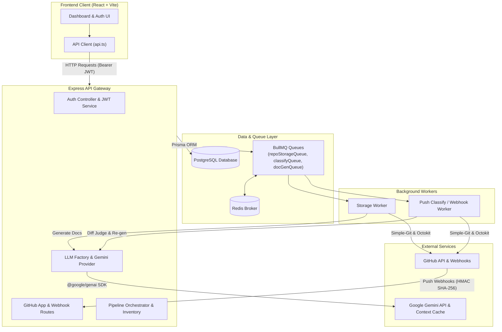
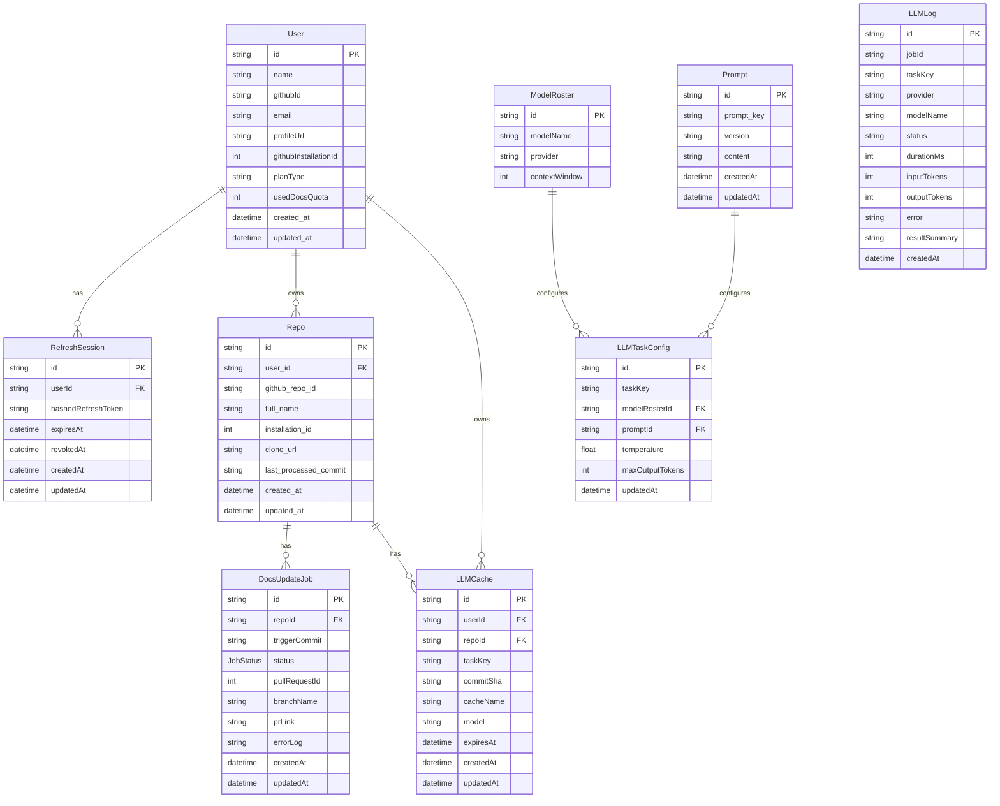

# System Architecture & Technical Documentation

## 1. System Overview
* **High-Level Purpose:** AutoDocs is an automated AI documentation engine designed to streamline technical documentation maintenance for GitHub repositories. It integrates directly with GitHub via OAuth and GitHub Apps, listens to repository commit push webhooks, processes file inventories and code diffs using asynchronous queue workers (BullMQ + Redis), and leverages Google Gemini LLMs with scoped context caching to generate and update dynamic `ARCHITECTURE.md` files via automated Pull Requests.
* **Core Design Pattern:** Layered Architecture combined with an Event-Driven Asynchronous Pipeline (Producer/Consumer Queues) and Provider Pattern for LLM services.

## 2. Technology Stack & Dependencies
| Category | Technology / Library | Purpose in this Project |
| :--- | :--- | :--- |
| Frontend Framework | React 18, Vite | Single-page application UI for developer dashboard and app authorization |
| Styling & Icons | Custom Glassmorphism CSS, Lucide React | Modern dark-theme developer UI icons and layout components |
| Backend Runtime | Node.js (v22), Express.js (v5) | REST API server, OAuth callback provider, and webhook receiver |
| Language | TypeScript | Full-stack static typing across server, workers, and client |
| Relational Database | PostgreSQL 17, Prisma ORM (v7) | Data persistence for users, sessions, imported repositories, jobs, and LLM logs/caches |
| Queue & In-Memory Store | Redis 8, BullMQ (v6) | Asynchronous task queues for disk storage operations, push classification, and LLM doc generation |
| AI / LLM Engine | Google GenAI SDK (`@google/genai`), Tiktoken | Code tokenization, LLM diff evaluation, structured doc generation, and Gemini context caching |
| Git & GitHub Integration | Octokit (`@octokit/rest`, `@octokit/auth-app`), Simple-Git | GitHub App installation token management, repository clone/pull, branch management, and PR creation |
| Authentication | JWT (`jsonwebtoken`), Bcrypt, Cookie-Parser | Access token authorization and secure HttpOnly refresh token session management |

## 3. High-Level Architecture Diagram


## 4. Directory & Module Structure
```
. 
├── client/                       # React + Vite Frontend Application
│   ├── src/
│   │   ├── components/          # UI pages and components (Dashboard, RepoList, Banner, Login)
│   │   ├── context/             # AuthContext for user state & token refresh
│   │   ├── services/            # API fetch client wrapper with automatic retry on 401
│   │   ├── App.tsx              # Root application router component
│   │   └── types.ts             # Client-side TypeScript interfaces
│   └── vite.config.ts           # Vite server configuration and dev proxies
├── src/                          # Express Backend Application
│   ├── admin/                   # Admin controllers and telemetry endpoints
│   ├── auth/                    # OAuth providers (GitHub), JWT signing, session handlers
│   ├── config/                  # Environment variable schema validation & Redis setup
│   ├── dashboard/               # Developer dashboard statistical service
│   ├── github/                  # GitHub App permissions, repo cloning, webhook verification
│   ├── jobs/                    # Documentation update job query and retry handlers
│   ├── LLM/                     # Gemini provider, factory, Zod schema mappings, scoped caching
│   ├── pipeline/                # Inventory scanners, diff judges, and pipeline orchestrator
│   ├── prisma/                  # Prisma Client initializer, migrations, and schema definition
│   ├── queue/                   # BullMQ publisher queues and job payload interfaces
│   ├── repo/                    # Repository details and manual doc generation endpoints
│   ├── user/                    # User profile controller and service layer
│   ├── worker/                  # Storage worker and push classify queue consumers
│   └── index.ts                 # Server entry point, route registrations, and middleware
├── Dockerfile                   # Docker image definition with git alpine binaries
└── docker-compose.yml           # Container orchestrator (App, Postgres 17, Redis 8)
```

## 5. Data Models & Database Schema


## 6. API Surface, Routes & Interfaces

| Method | Endpoint | Auth | Description |
| :--- | :--- | :--- | :--- |
| `GET` | `/auth/github` | None | Initiates GitHub OAuth login flow |
| `GET` | `/auth/github/callback` | None | Handles GitHub OAuth callback and sets HttpOnly refresh token cookie |
| `POST` | `/auth/refresh` | Cookie | Validates refresh token session and issues a new access token |
| `POST` | `/auth/logout` | Cookie | Revokes active refresh token session |
| `DELETE` | `/auth/user` | Bearer JWT | Deletes user account and associated credentials |
| `POST` | `/api/webhooks/github` | HMAC Signature | Receives GitHub push events with signature validation |
| `GET` | `/api/github/setup` | Query State | GitHub App post-installation callback handler |
| `GET` | `/api/github/installation-status` | Bearer JWT | Fetches GitHub App installation status for user |
| `GET` | `/api/github/accessible-repos` | Bearer JWT | Fetches accessible repositories from GitHub App installation |
| `GET` | `/api/github/imported-repos` | Bearer JWT | Retrieves user's imported repositories |
| `POST` | `/api/github/import-repo` | Bearer JWT | Imports repository and queues initial documentation job |
| `DELETE` | `/api/github/repo/:repoId` | Bearer JWT | Removes repository, cleans local workspace, and deletes associated jobs |
| `GET` | `/api/dashboard/stats` | Bearer JWT | Retrieves user quota and job execution statistics |
| `GET` | `/api/jobs` | Bearer JWT | Lists documentation update jobs with optional filters |
| `GET` | `/api/jobs/:jobId` | Bearer JWT | Retrieves specific job status and error logs |
| `POST` | `/api/jobs/:jobId/retry` | Bearer JWT | Re-queues a failed or pending documentation job |
| `GET` | `/api/repos/:repoId` | Bearer JWT | Fetches repository details and recent executions |
| `POST` | `/api/repos/:repoId/trigger` | Bearer JWT | Triggers a manual documentation generation pipeline run |
| `GET` | `/api/repos/:repoId/docs` | Bearer JWT | Retrieves current generated `ARCHITECTURE.md` file |
| `GET` | `/api/llm-config` | Bearer JWT | Admin endpoint to view LLM task configurations |
| `GET` | `/api/prompts` | Bearer JWT | Admin endpoint to list prompt templates |
| `GET` | `/api/models` | Bearer JWT | Admin endpoint to list model roster items |

## 7. Key Data Flows & Sequences

```mermaid
sequenceDiagram
    autonumber
    actor Developer
    participant UI as React Dashboard
    participant API as Express Server
    participant Queue as BullMQ Storage Queue
    participant Worker as Storage Worker
    participant LLM as Gemini Provider & Cache
    participant GitHub as GitHub App API

    Developer->>UI: Select repo & click 